# ChatFlow

ChatFlow is a Flutter + NestJS messaging app with:
- Email/passcode sign up and sign in
- Google sign in
- Contact-based discovery (only saved phone contacts appear)
- Direct messaging and group messaging
- User profile and settings tabs
- Runtime Android permissions (contacts, camera, microphone, storage/media)

## Tech Stack

- Frontend: Flutter, Dart
- Backend: NestJS, TypeScript, Mongoose
- Database: MongoDB
- Auth: JWT + Google ID token verification
- Local storage: SharedPreferences

## Project Structure

```text
.
|-- lib/                      # Flutter app
|   |-- views/                # Screens (auth, chats, profile, settings)
|   |-- viewmodels/           # Input validation + screen actions
|   |-- services/             # Auth service, repository, permissions
|   |-- models/               # Chat/contact models
|   `-- core/constants/       # Endpoints, colors, sizes
|-- backend/                  # NestJS API
|   `-- src/
|       |-- auth/
|       |-- users/
|       |-- groups/
|       |-- messages/
|       `-- common/crypto/
|-- screenshots/              # App screenshots used in this README
`-- README.md
```

## Features

### Authentication
- `POST /api/auth/register` for local account creation
- `POST /api/auth/login` for passcode login
- `POST /api/auth/google` for Google login
- `GET /api/auth/session` for session validation

### Contacts
- Reads local phone contacts using runtime permission
- Fetches backend users
- Matches users by phone number and only shows saved contacts

### Chats
- One-to-one conversations
- Group creation and group conversations
- Last message + updated time in chat list

### Security
- Message content encrypted in backend (AES-256-GCM)
- Phone number stored encrypted in backend
- Passcodes hashed with PBKDF2
- JWT token-based session

## Prerequisites

- Flutter SDK (stable)
- Dart SDK (matching Flutter)
- Node.js 18+
- MongoDB (local or cloud)
- Android Studio + emulator/device

## Backend Setup

1. Create env file:
   - Copy `backend/.env.example` to `backend/.env`
2. Fill values in `backend/.env`:
   - `PORT`
   - `MONGODB_URI`
   - `MESSAGE_ENCRYPTION_KEY` (64-char hex)
   - `JWT_SECRET`
   - `JWT_EXPIRES_IN`
   - `GOOGLE_CLIENT_IDS` (comma-separated allowed client IDs)
3. Install dependencies:

```powershell
cd backend
npm install
```

4. Run backend:

```powershell
npm run start:dev
```

Backend starts at: `http://localhost:3000/api`

## Flutter Setup

1. Install dependencies:

```powershell
flutter pub get
```

2. Ensure API base URL is correct in:
- `lib/core/constants/app_endpoints.dart`

3. Run app with Google client IDs:

```powershell
flutter run --dart-define=GOOGLE_SERVER_CLIENT_ID=YOUR_WEB_CLIENT_ID.apps.googleusercontent.com --dart-define=GOOGLE_WEB_CLIENT_ID=YOUR_WEB_CLIENT_ID.apps.googleusercontent.com
```

PowerShell multiline format (if needed):

```powershell
flutter run `
  --dart-define=GOOGLE_SERVER_CLIENT_ID=YOUR_WEB_CLIENT_ID.apps.googleusercontent.com `
  --dart-define=GOOGLE_WEB_CLIENT_ID=YOUR_WEB_CLIENT_ID.apps.googleusercontent.com
```

## Android Permissions

Declared in `android/app/src/main/AndroidManifest.xml`:
- Camera
- Record audio (microphone)
- Read contacts
- Legacy storage + Android 13 media permissions

Requested at runtime in:
- `lib/services/app_permissions_service.dart`

## API Summary

- Auth:
  - `POST /api/auth/register`
  - `POST /api/auth/login`
  - `POST /api/auth/google`
  - `GET /api/auth/session`
- Users:
  - `GET /api/users?excludeId=<id>`
  - `GET /api/users/:id`
- Groups:
  - `POST /api/groups`
  - `GET /api/groups?memberId=<id>`
  - `GET /api/groups/:id`
- Messages:
  - `POST /api/messages/direct`
  - `POST /api/messages/group`
  - `GET /api/messages/direct/:userAId/:userBId`
  - `GET /api/messages/group/:groupId`

## Screenshots

### Splash Screens
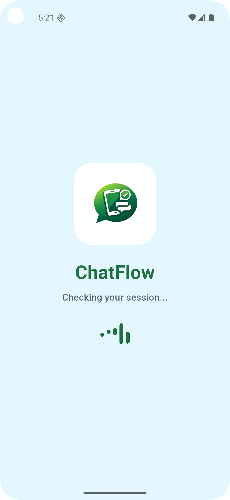
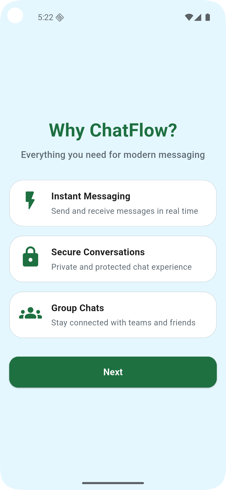
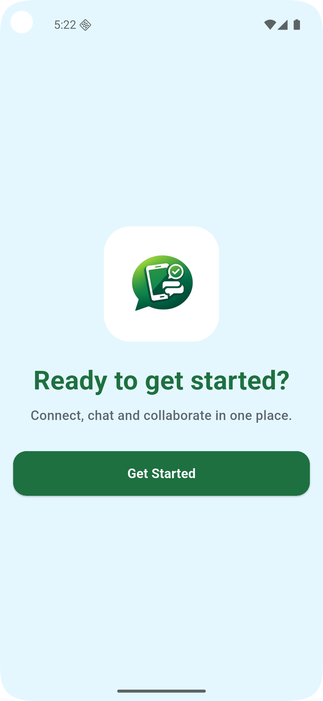

### Auth
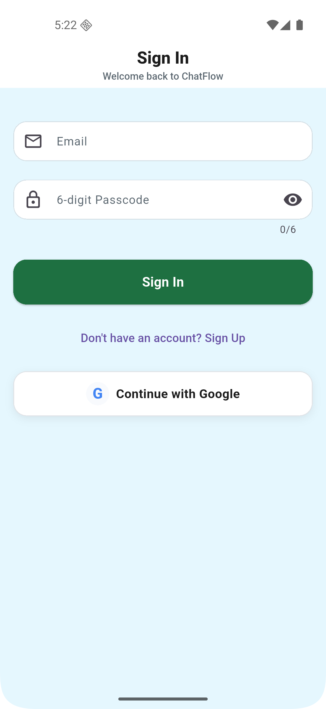
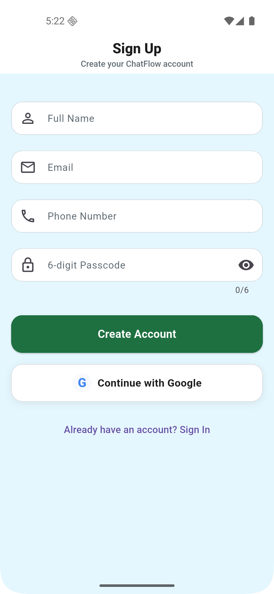

### Main Tabs
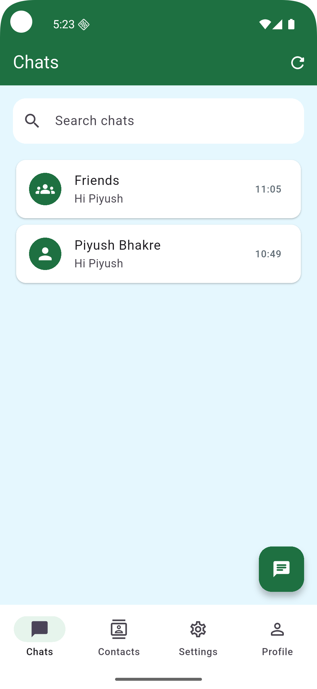
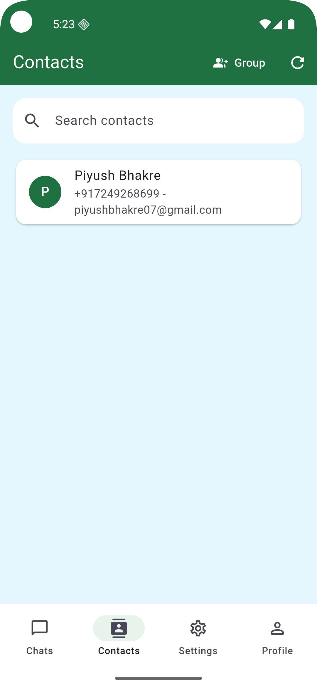
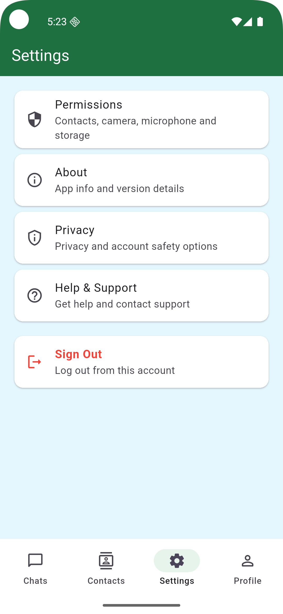
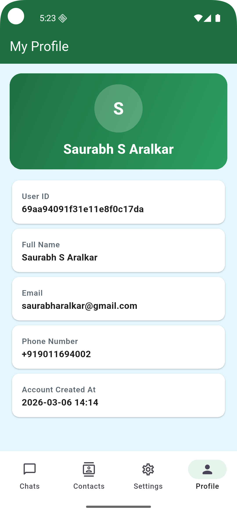

### Chat Flow
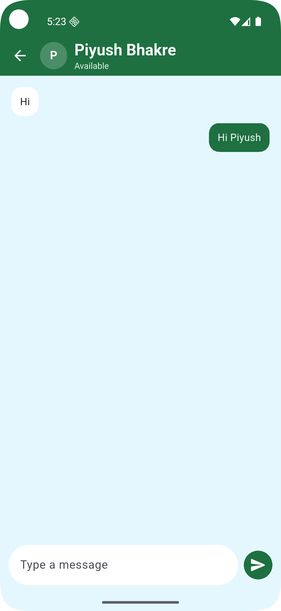
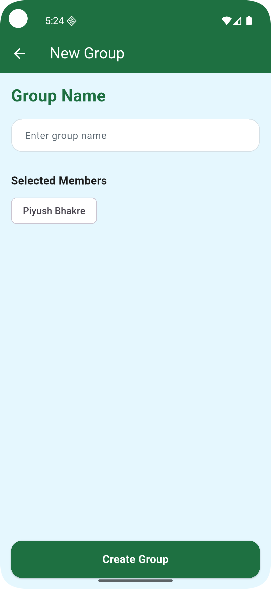

## Notes

- `PROJECT_HANDBOOK.md` is now ignored by git and kept local.
- Do not commit `backend/.env` or any secrets.
